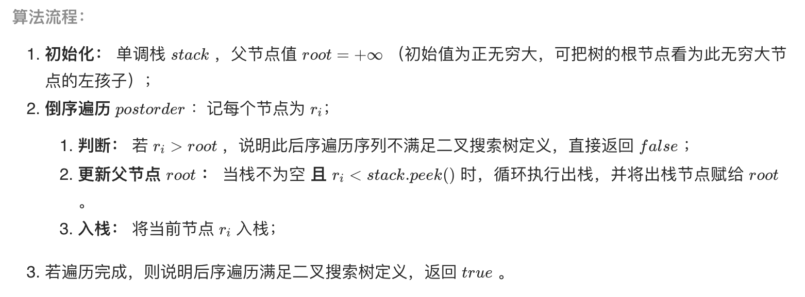

# 33. 二叉搜索树的后序遍历序列

## 1.题目描述

输入一个整数数组，判断该数组是不是某二叉搜索树的后序遍历结果。如果是则返回 `true`，否则返回 `false`。假设输入的数组的任意两个数字都互不相同。

参考以下这颗二叉搜索树：

```text
      5
     / \
    2   6
   / \
  1   3
```

**示例 1：**

```text
 输入: [1,6,3,2,5]
 输出: false
```

**示例 2：**

```text
 输入: [1,3,2,6,5]
 输出: true
```

**提示：**

1. `数组长度 <= 1000`

## 2.解题思路

### 2.1 方法一：栈

> 后序遍历的结果为  左子树｜右子树｜根结点。--&gt;根结点就是最后一个root结点 $$r_{n-1}$$ ，如果 $$r_{n-2}$$ 小于root结点的值，则表示root没有右子树，之后遍历的结果不存在会比root值小的结点；如果 $$r_{n-2}$$ 大于root结点的值，则是表示为root的右子树。



#### 代码实现

```text
/**
 * 栈
 */
public boolean verifyPostorder(int[] postorder) {
    Stack<Integer> stack = new Stack<>();
    int root = Integer.MAX_VALUE;
    for (int i = postorder.length - 1; i >= 0; i--) {
        if (postorder[i] > root) {
            return false;
        }
        while (!stack.isEmpty() && stack.peek() > postorder[i]) {
            root = stack.pop();
        }
        stack.push(postorder[i]);
    }
    return true;
}
```

#### 复杂度分析

> 时间复杂度：O\(n\)
>
> 空间复杂度：O\(n\)

### 2.2 方法二：递归

> 递归方法，分别判断左右子树是否为后序遍历。
>
> 左子树的值都小于根结点的值，右子树的值都大于根结点。
>
> 后序遍历的结果为  左子树｜右子树｜根结点。--&gt;我们可以得到根结点为遍历序列的最后一个结点，然后比较于根结点的大小可以得到左右子树。递归判断左右子树得到最终结果。

```text
/**
 * 递归
 */

public boolean verifyPostorder2(int[] postorder) {
    return recur(postorder, 0, postorder.length - 1);
}

boolean recur(int[] postorder, int left, int right) {
    if (left >= right) {
        return true;
    }
    int l = left;
    while (postorder[l] < postorder[right]) {
        l++;
    }
    int r = l;
    while (postorder[l] > postorder[right]) {
        l++;
    }
    // 正常的后序遍历  左子树|右子树|根结点，经过遍历查找左子树和右子树后l会等于right，否则该序列不为搜索二叉树的后序遍历序列
    return l == right && recur(postorder, left, r - 1) && recur(postorder, r, right - 1);
}
```

#### 复杂度分析

> 时间复杂度：O\(n\)
>
> 空间复杂度：O\(n\)

## 3.参考

* [https://leetcode-cn.com/problems/er-cha-sou-suo-shu-de-hou-xu-bian-li-xu-lie-lcof/](https://leetcode-cn.com/problems/er-cha-sou-suo-shu-de-hou-xu-bian-li-xu-lie-lcof/)
* [https://leetcode-cn.com/problems/er-cha-sou-suo-shu-de-hou-xu-bian-li-xu-lie-lcof/solution/mian-shi-ti-33-er-cha-sou-suo-shu-de-hou-xu-bian-6/](https://leetcode-cn.com/problems/er-cha-sou-suo-shu-de-hou-xu-bian-li-xu-lie-lcof/solution/mian-shi-ti-33-er-cha-sou-suo-shu-de-hou-xu-bian-6/)

