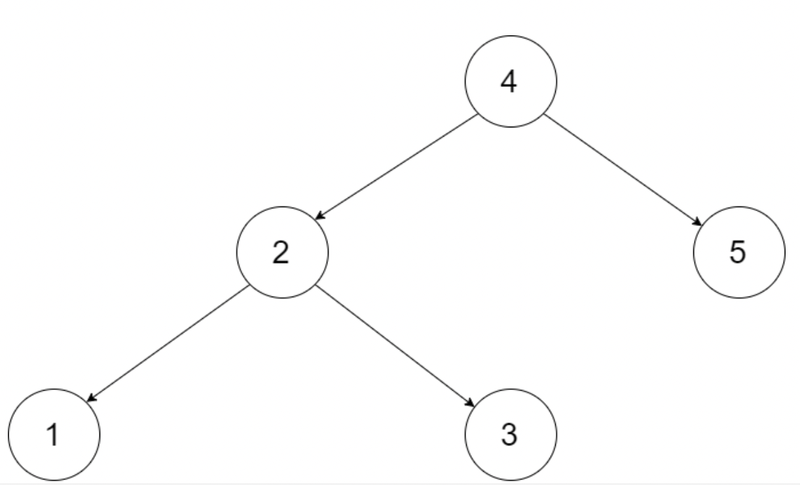
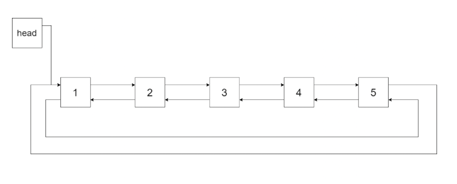

# 36. 二叉搜索树与双向链表【中序遍历】

## 1.题目描述

输入一棵二叉搜索树，将该二叉搜索树转换成一个排序的循环双向链表。要求不能创建任何新的节点，只能调整树中节点指针的指向。

为了让您更好地理解问题，以下面的二叉搜索树为例：



我们希望将这个二叉搜索树转化为双向循环链表。链表中的每个节点都有一个前驱和后继指针。对于双向循环链表，第一个节点的前驱是最后一个节点，最后一个节点的后继是第一个节点。

下图展示了上面的二叉搜索树转化成的链表。“head” 表示指向链表中有最小元素的节点。



特别地，我们希望可以就地完成转换操作。当转化完成以后，树中节点的左指针需要指向前驱，树中节点的右指针需要指向后继。还需要返回链表中的第一个节点的指针。

## 2.解题思路

### 2.1 方法一：中序遍历

> 中序遍历，访问左子树，根结点，右子树。
>
> 对访问根结点过程进行本题操作，将根结点的left指向pre结点，pre.right指向根结点，访问过的根结点自然转变为pre结点。注：当pre为null是，表示还没有访问过根结点，则当前结点为head结点。

#### 代码实现

```text
/**
 * DFS 中序遍历
 */
Node pre, head;

public Node treeToDoublyList(Node root) {
    if (root == null) {
        return null;
    }
    dfs(root);
    pre.right = head;
    head.left = pre;
    return head;
}

private void dfs(Node root) {
    if (root == null) {
        return;
    }
    dfs(root.left);
    // 访问根结点
    if (pre != null) {
        pre.right = root; // 前驱的后继结点指向根结点
    } else {
        // pre结点为空，则赋值head头结点
        head = root;
    }
    root.left = pre; // 根结点前驱指向pre结点
    pre = root; // 访问过的根结点转变为pre结点
    dfs(root.right);
}
```

#### 复杂度分析

> 时间复杂度：O\(n\)
>
> 空间复杂度：O\(n\) \#递归栈

## 3.参考

* [https://leetcode-cn.com/problems/er-cha-sou-suo-shu-yu-shuang-xiang-lian-biao-lcof/](https://leetcode-cn.com/problems/er-cha-sou-suo-shu-yu-shuang-xiang-lian-biao-lcof/)

