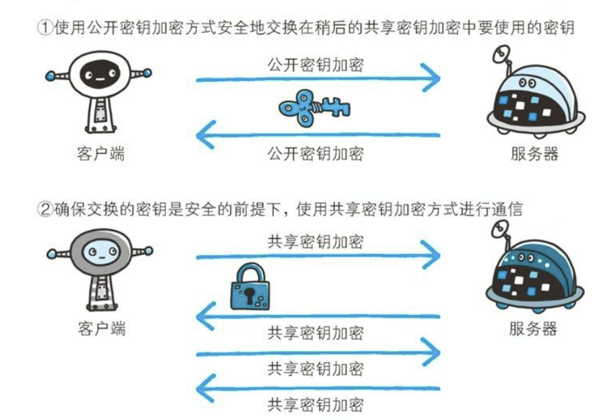

# 《图解HTTP》

## 1.HTTPS加密方式

### 1.1 共享密钥加密--对称加密

> 加密和解密都是需要密钥的。没有密钥就无法对密码解密。如果密钥被攻击者获得，那么加密也失去了意义。

加密与解密同**用一个密钥**的方式称为**共享密钥加密**（Common key crypto system），也称为**对称密钥加密**。

* 优点：运算速度**快**；
* 缺点：无法安全地将密钥传输给通信方。


### 1.2 公开密钥加密**--非对称加密**

        公开密钥加密使用一对**非对称的密钥**。一把叫做私有密钥 \(private key\)，另一把叫做公开密钥\(public key\)。顾名思义，私有密钥不能让其他任何人知道，而公开密钥则可以随意发布，任何人都可以获得。--&gt;加密解密的密钥**不同**。

        使用公开密钥加密方式，发送密文的一方使用对方的公开密钥进行加密处理，对方收到被加密的信息后，再使用自己的私有密钥进行解密。利用这种方式，不需要发送用来解密的私有密钥，也不必担心密钥被攻击者窃听而盗走。


* 优点：可以更安全地将公开密钥传输给通信发送方；保证传输的安全性。
* 缺点：运算速度慢。

### **1.3 HTTPS 采用的加密方式**

> 适用公开密钥加密方式进行传输对称加密算法的密钥。
>
> 对称加密算法的密钥传输完成后，适用对称加密的算法进行加密通信。

上面提到对称密钥加密方式的**传输效率更高**，但是无法安全地将密钥 Secret Key 传输给通信方。而非对称密钥加密方式可以保证**传输的安全性**，因此我们可以利用非对称密钥加密方式将 Secret Key 传输给通信方。HTTPS 采用混合的加密机制，正是利用了上面提到的方案：

* 使用非对称密钥加密方式，传输对称密钥加密方式所需要的 Secret Key，从而保证安全性;
* 获取到 Secret Key 后，再使用对称密钥加密方式进行通信，从而保证效率。



## 2.HTTP缺点

> 这里主要针对HTTPS来说，为了凸显HTTPS与HTTP的差别

* **不加密**：通信使用明文（不加密），内容可能会被窃听
* **不验证身份**：不验证通信方的身份，有可能遭遇伪装
* **完整性无法保证** ：无法证明报文的完整性，有可能已遭篡改

## 3.网页访问网站流程、HTTP报文发送全过程\*



[在浏览器中输入网址回车后发生了什么](url-trace.md)

URL访问过程：


## 4.HTTP状态码

服务器返回的 **响应报文** 中第一行为状态行，包含了状态码以及原因短语，用来告知客户端请求的结果。

| 状态码 | 类别 | 含义 |
| :--- | :--- | :--- |
| 1XX | Informational（信息性状态码） | 接收的请求正在处理 |
| 2XX | Success（成功状态码） | 请求正常处理完毕 |
| 3XX | Redirection（重定向状态码） | 需要进行附加操作以完成请求 |
| 4XX | Client Error（客户端错误状态码） | 服务器无法处理请求 |
| 5XX | Server Error（服务器错误状态码） | 服务器处理请求出错 |

#### 1XX 信息

* **100 Continue** ：表明到目前为止都很正常，客户端可以继续发送请求或者忽略这个响应。

#### 2XX 成功

* **200 OK**
* **204 No Content** ：请求已经成功处理，但是返回的响应报文不包含实体的主体部分。一般在只需要从客户端往服务器发送信息，而不需要返回数据时使用。
* **206 Partial Content** ：表示客户端进行了范围请求，响应报文包含由 Content-Range 指定范围的实体内容。

#### 3XX 重定向

* **301 Moved Permanently** ：永久性重定向
* **302 Found** ：临时性重定向
* **303 See Other** ：和 302 有着相同的功能，但是 303 明确要求客户端应该采用 GET 方法获取资源。
* 注：虽然 HTTP 协议规定 301、302 状态下重定向时不允许把 POST 方法改成 GET 方法，但是大多数浏览器都会在 301、302 和 303 状态下的重定向把 POST 方法改成 GET 方法。
* **304 Not Modified** ：如果请求报文首部包含一些条件，例如：If-Match，If-Modified-Since，If-None-Match，If-Range，If-Unmodified-Since，如果不满足条件，则服务器会返回 304 状态码。
* **307 Temporary Redirect** ：临时重定向，与 302 的含义类似，但是 307 要求浏览器不会把重定向请求的 POST 方法改成 GET 方法。

#### 4XX 客户端错误

* **400 Bad Request** ：请求报文中存在语法错误。
* **401 Unauthorized** ：该状态码表示发送的请求需要有认证信息（BASIC 认证、DIGEST 认证）。如果之前已进行过一次请求，则表示用户认证失败。
* **403 Forbidden** ：请求被拒绝。
* **404 Not Found**

#### 5XX 服务器错误

* **500 Internal Server Error** ：服务器正在执行请求时发生错误。
* **503 Service Unavailable** ：服务器暂时处于超负载或正在进行停机维护，现在无法处理请求。

| 状态码 | 类别 | 原因短语 |
| :--- | :--- | :--- |
| **1XX** | **Informational\(信息性状态码\)** | **接收的请求正在处理** |
| **2XX** | **Success\(成功状态码\)** | **请求正常处理完毕** |
| 200 | OK | 请求正常处理完毕 |
| 204 | No Content | 请求处理成功，但是没有资源返回 |
| 206 | Partial Content | 请求处理成功，返回一部分资源&lt;–范围请求 |
| **3XX** | **Redirection\(重定向状态码\)** | **需要进行附加操作以完成请求** |
| 301 | Moved Permanently | 永久性重定向–&gt;请求资源的链接已永久性发生改变,书签需要更改链接 |
| 302 | Found | 临时性重定向–&gt;希望访问临时改变的URI，书签中不需要更改链接 |
| 303 | See Other | 请求对应的资源存在着另一个 URI，请使用GET方法进行获取 |
| 304 | Not Modified | 服务器端允许请求访 问资源，但未满足条件的情况。&lt;– 条件访问 |
| 307 | Temporary Redirect | 临时重定向–&gt;307 会遵照浏览器标准，不会从 POST 变成 GET。 |
| **4XX** | **Client Error\(客户端错误状态码\)** | **服务器无法处理请求** |
| 400 | Bad Request | 请求报文中存在语法错误 |
| 401 | Unauthorized | 请求需要有通过 HTTP 认证\(BASIC 认证、 DIGEST 认证\)的认证信息 |
| 403 | Forbidden | 请求资源的访问被服务器拒绝 |
| 404 | Not Found | 请求的资源,服务器上无法找到 |
| **5XX** | **Server Error\(服务器错误状态码\)** | **服务器处理请求出错** |
| 500 | Internal Server Error | 服务器端在执行请求时发生了错误 |
| 503 | Service Unavailable | 服务器暂时处于超负载或正在进行停机维护，现在无法 处理请求 |

## 5.HTTP首部

> 有 4 种类型的首部字段：通用首部字段、请求首部字段、响应首部字段和实体首部字段。

### 5.1 通用首部字段

| 首部字段名 | 说明 |
| :--- | :--- |
| Cache-Control | 控制缓存的行为 |
| Connection | 控制不再转发给代理的首部字段、管理持久连接 |
| Date | 创建报文的日期时间 |
| Pragma | 报文指令 |
| Trailer | 报文末端的首部一览 |
| Transfer-Encoding | 指定报文主体的传输编码方式 |
| Upgrade | 升级为其他协议 |
| Via | 代理服务器的相关信息 |
| Warning | 错误通知 |

### 5.2 请求首部字段

| 首部字段名 | 说明 |
| :--- | :--- |
| Accept | 用户代理可处理的媒体类型 |
| Accept-Charset | 优先的字符集 |
| Accept-Encoding | 优先的内容编码 |
| Accept-Language | 优先的语言（自然语言） |
| Authorization | Web 认证信息 |
| Expect | 期待服务器的特定行为 |
| From | 用户的电子邮箱地址 |
| Host | 请求资源所在服务器 |
| If-Match | 比较实体标记（ETag） |
| If-Modified-Since | 比较资源的更新时间 |
| If-None-Match | 比较实体标记（与 If-Match 相反） |
| If-Range | 资源未更新时发送实体 Byte 的范围请求 |
| If-Unmodified-Since | 比较资源的更新时间（与 If-Modified-Since 相反） |
| Max-Forwards | 最大传输逐跳数 |
| Proxy-Authorization | 代理服务器要求客户端的认证信息 |
| Range | 实体的字节范围请求 |
| Referer | 对请求中 URI 的原始获取方 |
| TE | 传输编码的优先级 |
| User-Agent | HTTP 客户端程序的信息 |

### 5.3 响应首部字段

| 首部字段名 | 说明 |
| :--- | :--- |
| Accept-Ranges | 是否接受字节范围请求 |
| Age | 推算资源创建经过时间 |
| ETag | 资源的匹配信息 |
| Location | 令客户端重定向至指定 URI |
| Proxy-Authenticate | 代理服务器对客户端的认证信息 |
| Retry-After | 对再次发起请求的时机要求 |
| Server | HTTP 服务器的安装信息 |
| Vary | 代理服务器缓存的管理信息 |
| WWW-Authenticate | 服务器对客户端的认证信息 |

### 5.4 实体首部字段

| 首部字段名 | 说明 |
| :--- | :--- |
| Allow | 资源可支持的 HTTP 方法 |
| Content-Encoding | 实体主体适用的编码方式 |
| Content-Language | 实体主体的自然语言 |
| Content-Length | 实体主体的大小 |
| Content-Location | 替代对应资源的 URI |
| Content-MD5 | 实体主体的报文摘要 |
| Content-Range | 实体主体的位置范围 |
| Content-Type | 实体主体的媒体类型 |
| Expires | 实体主体过期的日期时间 |
| Last-Modified | 资源的最后修改日期时间 |


## 

## 6.Cookie和Session\*

### 6.1 Cookie

> HTTP/1.1 引入 Cookie。

HTTP 协议是**无状态**的，主要是为了让 HTTP 协议尽可能简单，使得它能够处理大量事务。HTTP/1.1 引入 Cookie 来保存状态信息。

Cookie 是服务器发送到用户浏览器并保存在本地的一小块数据，它会在浏览器之后向同一服务器再次发起请求时被携带上，用于告知服务端两个请求是否来自同一浏览器。由于之后每次请求都会需要携带 Cookie 数据，因此会带来额外的性能开销（尤其是在移动环境下）。

Cookie 曾一度用于客户端数据的存储，因为当时并没有其它合适的存储办法而作为唯一的存储手段，但现在随着现代浏览器开始支持各种各样的存储方式，Cookie 渐渐被淘汰。新的浏览器 API 已经允许开发者直接将数据存储到本地，如使用 Web storage API（本地存储和会话存储）或 IndexedDB。

**1. 用途**

* 会话状态管理（如用户登录状态、购物车、游戏分数或其它需要记录的信息）
* 个性化设置（如用户自定义设置、主题等）
* 浏览器行为跟踪（如跟踪分析用户行为等）

**2. 创建过程**

服务器发送的响应报文包含 Set-Cookie 首部字段，客户端得到响应报文后把 Cookie 内容保存到浏览器中。

```text
 HTTP/1.1 200 OK
 Content-type: text/html
 Set-Cookie: yummy_cookie=choco
 Set-Cookie: tasty_cookie=strawberry
 ​
 [page content]
```

客户端之后对同一个服务器发送请求时，会从浏览器中取出 Cookie 信息并通过 Cookie 请求首部字段发送给服务器。\[将Cookie信息一同请求发送到服务器\]

```text
 GET /sample_page.html HTTP/1.1
 Host: www.example.org
 Cookie: yummy_cookie=choco; tasty_cookie=strawberry
```

**3. 分类**

* 会话期 Cookie：浏览器关闭之后它会被自动删除，也就是说它**仅在会话期内有效**。
* 持久性 Cookie：指定过期时间（Expires）或有效期（max-age）之后就成为了持久性的 Cookie。

```text
 Set-Cookie: id=a3fWa; Expires=Wed, 21 Oct 2015 07:28:00 GMT;// 设置过期时间
```

**4. 作用域**

Domain 标识指定了哪些主机可以接受 Cookie。如果不指定，默认为创建Cookie的服务器域名（不包含子域名）。如果指定了 Domain，则一般包含子域名。例如，如果设置 Domain=mozilla.org，则 Cookie 也包含在子域名中（如 developer.mozilla.org）。

Path 标识指定了主机下的哪些路径可以接受 Cookie（该 URL 路径必须存在于请求 URL 中）。以字符 %x2F \("/"\) 作为路径分隔符，子路径也会被匹配。例如，设置 Path=/docs，则以下地址都会匹配：【如果不指定，默认为文档所在的文件目录】

* /docs
* /docs/Web/
* /docs/Web/HTTP

**5. JavaScript**

浏览器通过 `document.cookie` 属性可创建新的 Cookie，也可通过该属性访问非 HttpOnly 标记的 Cookie。【HttpOnly属性可以防止javaScript访问Cookie，只允许HTTP协议访问】

```text
 document.cookie = "yummy_cookie=choco";
 document.cookie = "tasty_cookie=strawberry";
 console.log(document.cookie);
```

**6. HttpOnly**

标记为 HttpOnly 的 Cookie 不能被 JavaScript 脚本调用。跨站脚本攻击 \(XSS\) 常常使用 JavaScript 的 `document.cookie` API 窃取用户的 Cookie 信息，因此使用 HttpOnly 标记可以在一定程度上避免 XSS 攻击。

```text
 Set-Cookie: id=a3fWa; Expires=Wed, 21 Oct 2015 07:28:00 GMT; Secure; HttpOnly
```

**7. Secure**

标记为 Secure 的 Cookie 只能通过被 HTTPS 协议加密过的请求发送给服务端。但即便设置了 Secure 标记，敏感信息也不应该通过 Cookie 传输，因为 Cookie 有其固有的不安全性，Secure 标记也无法提供确实的安全保障。

### **6.1.8.Session**

> 数据是存储在服务器端的。

除了可以将用户信息通过 Cookie 存储在用户浏览器中，也可以利用 Session 存储在服务器端，存储在服务器端的信息更加安全。

Session 可以存储在服务器上的文件、数据库或者内存中。也可以将 Session 存储在 Redis 这种内存型数据库中，效率会更高。

使用 Session 维护用户登录状态的过程如下：

* 用户进行登录时，用户提交包含用户名和密码的表单，放入 HTTP 请求报文中；
* 服务器验证该用户名和密码，如果正确则把用户信息存储到 Redis 中，它在 Redis 中的 Key 称为 Session ID；
* 服务器返回的响应报文的 Set-Cookie 首部字段包含了这个 Session ID，客户端收到响应报文之后将该 Cookie 值存入浏览器中；
* 客户端之后对同一个服务器进行请求时会包含该 Cookie 值，服务器收到之后提取出 Session ID，从 Redis 中取出用户信息，继续之前的业务操作。

应该注意 Session ID 的安全性问题，不能让它被恶意攻击者轻易获取，那么就不能产生一个容易被猜到的 Session ID 值。此外，还需要经常重新生成 Session ID。在对安全性要求极高的场景下，例如转账等操作，除了使用 Session 管理用户状态之外，还需要对用户进行重新验证，比如重新输入密码，或者使用短信验证码等方式。

**9. 浏览器禁用 Cookie**

此时无法使用 Cookie 来保存用户信息，只能使用 Session。除此之外，不能再将 Session ID 存放到 Cookie 中，而是使用 URL 重写技术，将 Session ID 作为 URL 的参数进行传递。

**10. Cookie 与 Session 选择**

* Cookie 只能存储 ASCII 码字符串，而 Session 则可以存储任何类型的数据，因此在考虑**数据复杂性**时首选 Session；
* Cookie 存储在浏览器中，容易被恶意查看。如果非要将一些隐私数据存在 Cookie 中，可以将 Cookie 值进行加密，然后在服务器进行解密；
* 对于大型网站，如果用户所有的信息都存储在 Session 中，那么开销是非常大的，因此不建议将所有的用户信息都存储到 Session 中。

## 7.HTTP实现方式\*

> HTTP协议在应用层，那肯定是基于传输层来实现的，是基于传输层的TCP实现的。

参考链接：[https://www.runoob.com/http/http-intro.html](https://www.runoob.com/http/http-intro.html)

HTTP协议是Hyper Text Transfer Protocol（超文本传输协议）的缩写,是用于从万维网（WWW:World Wide Web ）服务器传输超文本到本地浏览器的传送协议。。

HTTP是一个**基于TCP/IP通信协议**来传递数据（HTML 文件, 图片文件, 查询结果等）。

超文本传输协议（HTTP，HyperText Transfer Protocol\)是互联网上应用最为广泛的一种网络协议。设计 HTTP 最初的目的是为了提供一种**发布和接收 HTML 页面的方法**。HTTP 协议是以**明文**方式发送信息的，如果黑客截取了 Web 浏览器和服务器之间的传输报文，就可以直接获得其中的信息。

① 客户端的浏览器首先要通过 TCP 与服务器建立连接，一般 TCP 连接的端口号是80。 建立连接后，客户机发送一个请求给服务器，请求方式的格式为：统一资源标识符（URL）、协议版本号，后边是 MIME 信息包括请求修饰符、客户机信息和许可内容。

② 服务器接到请求后，给予相应的响应信息，其格式为一个状态行，包括信息的协议版本号、一个成功或错误的代码，后边是 MIME 信息包括服务器信息、实体信息和可能的内容。

### HTTP工作原理

HTTP协议工作于客户端-服务端架构上。浏览器作为HTTP客户端通过URL向HTTP服务端即WEB服务器发送所有请求。

Web服务器有：Apache服务器，IIS服务器（Internet Information Services）等。

Web服务器根据接收到的请求后，向客户端发送响应信息。

HTTP默认端口号为80，但是你也可以改为8080或者其他端口。

**HTTP三点注意事项：**

* HTTP是**无连接**：无连接的含义是限制每次连接只处理一个请求。服务器处理完客户的请求，并收到客户的应答后，即断开连接。**采用这种方式可以节省传输时间**。
* HTTP是**媒体独立的**：这意味着，只要客户端和服务器知道如何处理的数据内容，任何类型的数据都可以通过HTTP发送。客户端以及服务器指定使用适合的MIME-type内容类型。
* HTTP是无状态：HTTP协议是无状态协议。无状态是指协议对于事务处理没有记忆能力。缺少状态意味着如果后续处理需要前面的信息，则它必须重传，这样可能导致每次连接传送的数据量增大。另一方面，在服务器不需要先前信息时它的应答就较快。

以下图表展示了HTTP协议通信流程：


注：CGI是外部应用程序与WEB服务器之间的接口标准。

MIME\(Multipurpose Internet Mail Extensions\):多用途互联网邮件扩展类型

## ^8.抓包 Wire shark

## 9.HTTP缓存

### **1. 优点**

* 缓解服务器压力；
* 降低客户端获取资源的延迟：缓存通常位于内存中，读取缓存的速度更快。并且缓存服务器在地理位置上也有可能比源服务器来得近，例如浏览器缓存。

### **2. 实现方法**

* 让代理服务器进行缓存；
* 让客户端浏览器进行缓存。

### **3. Cache-Control**

HTTP/1.1 通过 Cache-Control 首部字段来**控制缓存**。

#### **3.1 禁止进行缓存**

no-store 指令规定不能对请求或响应的任何一部分进行缓存。

```text
 Cache-Control: no-store
```

#### **3.2 强制确认缓存**

**no-cache** 指令规定缓存服务器需要先向源服务器验证缓存资源的**有效性**，只有当缓存资源有效时才能使用该缓存对客户端的请求进行响应。

```text
 Cache-Control: no-cache
```

#### **3.3 私有缓存和公共缓存**

private 指令规定了将资源作为私有缓存，只能被单独用户使用，一般存储在用户浏览器中。

```text
 Cache-Control: private
```

public 指令规定了将资源作为公共缓存，可以被多个用户使用，一般存储在代理服务器中。

```text
 Cache-Control: public
```

#### **3.4 缓存过期机制**

max-age 指令出现在请求报文，并且缓存资源的缓存时间小于该指令指定的时间，那么就能接受该缓存。

max-age 指令出现在响应报文，表示缓存资源在缓存服务器中保存的时间。

```text
 Cache-Control: max-age=31536000
```

Expires 首部字段也可以用于告知缓存服务器该资源什么时候会**过期**。

```text
 Expires: Wed, 04 Jul 2012 08:26:05 GMT
```

* 在 HTTP/1.1 中，会优先处理 max-age 指令；
* 在 HTTP/1.0 中，max-age 指令会被忽略掉。

### **4. 缓存验证**

需要先了解 ETag 首部字段的含义，它是资源的唯一标识。URL 不能唯一表示资源，例如 `http://www.google.com/` 有中文和英文两个资源，只有 ETag 才能对这两个资源进行唯一标识。

```text
 ETag: "82e22293907ce725faf67773957acd12"
```

可以将缓存资源的 ETag 值放入 If-None-Match 首部，服务器收到该请求后，判断缓存资源的 ETag 值和资源的最新 ETag 值是否一致，如果一致则表示缓存资源有效，返回 304 Not Modified。

```text
 If-None-Match: "82e22293907ce725faf67773957acd12"
```

Last-Modified 首部字段也可以用于缓存验证，它包含在源服务器发送的响应报文中，指示源服务器对资源的最后修改时间。但是它是一种弱校验器，因为只能精确到一秒，所以它通常作为 ETag 的备用方案。如果响应首部字段里含有这个信息，客户端可以在后续的请求中带上 If-Modified-Since 来验证缓存。服务器只在所请求的资源在给定的日期时间之后对内容进行过修改的情况下才会将资源返回，状态码为 200 OK。如果请求的资源从那时起未经修改，那么返回一个不带有实体主体的 304 Not Modified 响应报文。

```text
 Last-Modified: Wed, 21 Oct 2015 07:28:00 GMT
```

```text
 If-Modified-Since: Wed, 21 Oct 2015 07:28:00 GMT
```

## 10.HTTP报文格式

> HTTP报文格式需要同[首部字段](http.md#5http-shou-bu)一起讨论。

### 10.1 请求和响应报文

客户端发送一个请求报文给服务器，服务器根据请求报文中的信息进行处理，并将处理结果放入响应报文中返回给客户端。

### 10.2 请求报文结构

* 第一行是包含了请求方法、URL、协议版本；
* 接下来的多行都是请求首部 Header，每个首部都有一个首部名称，以及对应的值。
* 一个空行用来分隔首部和内容主体 Body
* 最后是请求的内容主体

```text
 GET http://www.example.com/ HTTP/1.1
 Accept: text/html,application/xhtml+xml,application/xml;q=0.9,image/webp,image/apng,*/*;q=0.8,application/signed-exchange;v=b3;q=0.9
 Accept-Encoding: gzip, deflate
 Accept-Language: zh-CN,zh;q=0.9,en;q=0.8
 Cache-Control: max-age=0
 Host: www.example.com
 If-Modified-Since: Thu, 17 Oct 2019 07:18:26 GMT
 If-None-Match: "3147526947+gzip"
 Proxy-Connection: keep-alive
 Upgrade-Insecure-Requests: 1
 User-Agent: Mozilla/5.0 xxx
 ​
 param1=1&param2=2
```

### 10.3 响应报文结构

* 第一行包含协议版本、状态码以及描述，最常见的是 200 OK 表示请求成功了
* 接下来多行也是首部内容
* 一个空行分隔首部和内容主体
* 最后是响应的内容主体

```text
 HTTP/1.1 200 OK
 Age: 529651
 Cache-Control: max-age=604800
 Connection: keep-alive
 Content-Encoding: gzip
 Content-Length: 648
 Content-Type: text/html; charset=UTF-8
 Date: Mon, 02 Nov 2020 17:53:39 GMT
 Etag: "3147526947+ident+gzip"
 Expires: Mon, 09 Nov 2020 17:53:39 GMT
 Keep-Alive: timeout=4
 Last-Modified: Thu, 17 Oct 2019 07:18:26 GMT
 Proxy-Connection: keep-alive
 Server: ECS (sjc/16DF)
 Vary: Accept-Encoding
 X-Cache: HIT
 ​
 <!doctype html>
 <html>
 <head>
     <title>Example Domain</title>
   // 省略... 
 </body>
 </html>
```

## 11.HTTP 和 HTTPS区别\*

_**HTTPS = HTTP + 加密 + 认证 + 完整性保护**_

> 注：先说明[HTTP的缺点](http.md#2http-que-dian)。

### 11.1 加密

见本文[第一点](http.md#1https-jia-mi-fang-shi)说明。

### 11.2 认证

> 将公钥通过CA认证。

通过使用 **证书** 来对通信方进行认证。

数字证书认证机构（CA，Certificate Authority）是客户端与服务器双方都可信赖的第三方机构。

服务器的运营人员向 CA 提出公开密钥的申请，CA 在判明提出申请者的身份之后，会对已申请的公开密钥做数字签名，然后分配这个已签名的公开密钥，并将该公开密钥放入公开密钥证书后绑定在一起。

进行 HTTPS 通时，服务器会把证书发送给客户端。客户端取得其中的公开密钥之后，先使用数字签名进行验证，如果验证通过，就可以开始通信了。​


### 11.3 完整性保护

**SSL** 提供报文摘要功能来进行完整性保护。

HTTP 也提供了 MD5 报文摘要功能，但不是安全的。例如报文内容被篡改之后，同时重新计算 MD5 的值，通信接收方是无法意识到发生了篡改。

HTTPS 的报文摘要功能之所以安全，是因为它结合了加密和认证这两个操作。试想一下，加密之后的报文，遭到篡改之后，也很难重新计算报文摘要，因为无法轻易获取明文。

### 11.4 HTTP进化史\*\*\*

> 注：不管面试官怎么问，我回答的时候都可以从HTTP1.0开始递推到HTTP3.0

HTTP1和HTTP2的区别，HTTP2和HTTPS关系

**👉HTTP1.1相比HTTP1.0的优化**（挑几个点记住就行了）长连接、流水线、host字段、头部

1. **HTTP1.1支持长连接和请求的流水线处理**
   1. **HTTP 1.0规定浏览器与服务器只保持短暂的连接**，浏览器的每次请求都需要与服务器建立一个TCP连接，服务器完成请求处理后立即断开TCP连接，服务器不跟踪每个客户也不记录过去的请求。
   2. **HTTP 1.1则支持持久连接Persistent Connection,** 并且默认使用persistent connection。在同一个TCP的连接中可以传送多个HTTP请求和响应。多个请求和响应可以重叠，多个请求和响应可以同时进行。更加多的请求头和响应头\(比如HTTP1.0没有host的字段\)。
   3. **HTTP 1.1的持续连接，**也需要增加新的请求头来帮助实现，例如，Connection请求头的值为Keep-Alive时，客户端通知服务器返回本次请求结果后保持连接；Connection请求头的值为close时，客户端通知服务器返回本次请求结果后关闭连接。
2. **支持管道（pipeline）网络传输，只要第一个请求发出去了，不必等其回来，就可以发第二个请求出去，可以减少整体的响应时间**。//就是流水线
   1. 请求的流水线（Pipelining）处理，在一个TCP连接上可以传送多个HTTP请求和响应，减少了建立和关闭连接的消耗和延迟。例如：一个包含有许多图像的网页文件的多个请求和应答可以在一个连接中传输，但每个单独的网页文件的请求和应答仍然需要使用各自的连接。 HTTP 1.1还允许客户端不用等待上一次请求结果返回，就可以发出下一次请求，但服务器端必须按照接收到客户端请求的先后顺序依次回送响应结果，以保证客户端能够区分出每次请求的响应内容。
3. **HTTP 1.1还提供了与身份认证、状态管理和Cache缓存等机制相关的请求头和响应头。**
4. **HTTP1.1增加host字段**
   1. 在HTTP1.0中认为每台服务器都绑定一个唯一的IP地址，因此，请求消息中的URL并没有传递主机名（hostname）。但随着虚拟主机技术的发展，在一台物理服务器上可以存在多个虚拟主机（Multi-homed Web Servers），并且它们共享一个IP地址。
   2. **HTTP1.1的请求消息和响应消息都应支持Host头域**，且请求消息中如果没有Host头域会报告一个错误（400 Bad Request）。此外，服务器应该接受以绝对路径标记的资源请求。
5. 100（Continue）Status（节约带宽）
6. HTTP/1.1中引入了Chunked transfer-coding
7. HTTP/1.1在1.0的基础上加入了一些cache的新特性

👉**HTTP1.1的性能瓶颈**

l 请求 / 响应头部（Header）未经压缩就发送，首部信息越多延迟越大。只能压缩 Body 的部分；

l 发送冗长的首部。每次互相发送相同的首部造成的浪费较多；

l 服务器是按请求的顺序响应的，如果服务器响应慢，会招致客户端一直请求不到数据，也就是队头阻塞；

l 没有请求优先级控制；

l 请求只能从客户端开始，服务器只能被动响应。

👉**HTTP2针对HTTP1.1的优化** // 压缩头部、二进制、数据流、多路复用

**HTTP/2 协议是基于 HTTPS 的**，所以 HTTP/2 的安全性也是有保障的。

\1. 头部压缩

HTTP/2 会压缩头（Header）如果你同时发出多个请求，他们的头是一样的或是相似的，那么，协议会帮你消除重复的部分。这就是所谓的 HPACK 算法：在客户端和服务器同时维护一张头信息表，所有字段都会存入这个表，生成一个索引号，以后就不发送同样字段了，只发送索引号，这样就提高速度了。

\2. 二进制格式

HTTP/2 不再像 HTTP/1.1 里的纯文本形式的报文，而是全面采用了二进制格式，头信息和数据体都是二进制，并且统称为**帧**（frame）：头信息帧和数据帧。这样虽然对人不友好，但是对计算机非常友好，因为计算机只懂二进制，那么收到报文后，无需再将明文的报文转成二进制，而是直接解析二进制报文，这增加了数据传输的效率。

\3. 数据流

HTTP/2 的数据包不是按顺序发送的，同一个连接里面连续的数据包，可能属于不同的回应。因此，必须要对数据包做标记，指出它属于哪个回应。每个请求或回应的所有数据包，称为一个数据流（ Stream ）。每个数据流都标记着一个独一无二的编号，**其中规定客户端发出的数据流编号为奇数， 服务器发出的数据流编号为偶数**。客户端还可以指定数据流的优先级。优先级高的请求，服务器就先响应该请求。

\4. 多路复用

HTTP/2 是可以在一个连接中**并发多个请求或回应**，而不用按照顺序一一对应。移除了 HTTP/1.1 中的串行请求，不需要排队等待，也就不会再出现「队头阻塞」问题，降低了延迟，大幅度提高了连接的利用率。举例来说，在一个 TCP 连接里，服务器收到了客户端 A 和 B 的两个请求，如果发现 A 处理过程非常耗时，于是就回应 A 请求已经处理好的部分，接着回应 B 请求，完成后，再回应 A 请求剩下的部分。

\5. 服务器推送

HTTP/2 还在一定程度上改善了传统的**「请求 - 应答」**工作模式，服务不再是被动地响应，**也可以主动向客户端发送消息**。举例来说，在浏览器刚请求 HTML 的时候，就提前把可能会用到的 JS、CSS 文件等静态资源主动发给客户端，减少延时的等待，也就是服务器推送（Server Push，也叫 Cache Push）。

**👉HTTP/2 有哪些缺陷？HTTP/3 做了哪些优化？**// 3就是tcp换成udp

HTTP/2 主要的问题在于，**多个 HTTP 请求在复用一个 TCP 连接**，下层的 TCP 协议是不知道有多少个HTTP 请求的。所以一旦发生了丢包现象，就会触发 TCP 的重传机制，这样在一个 TCP 连接中的所有的 HTTP 请求都必须等待这个丢了的包被重传回来。

HTTP/1.1 中的管道（ pipeline）传输中如果有一个请求阻塞了，那么队列后请求也统统被阻塞住了。

HTTP/2 多个请求复用一个TCP连接，**一旦发生丢包，就会阻塞住所有的 HTTP 请求。**

这都是基于 TCP 传输层的问题，**所以 HTTP/3 把 HTTP 下层的 TCP 协议改成了 UDP！**

UDP 发生是不管顺序，也不管丢包的，所以不会出现 HTTP/1.1 的队头阻塞 和 HTTP/2 的一个丢包全部重传问题。

UDP 是不可靠传输的，**但基于 UDP 的 QUIC 协议可以实现类似 TCP 的可靠性传输。**

l QUIC【QUIC（Quick UDP Internet Connection）是谷歌制定的一种基于UDP的低时延的互联网传输层协议。】有自己的一套机制可以保证传输的可靠性的。当某个流发生丢包时，只会阻塞这个流，其他流不会受到影响。

l TLS3 升级成了最新的 1.3 版本，头部压缩算法也升级成了QPack 。

​ - 运输层安全TLS \(Transport Layer Security\)。

l HTTPS 要建立一个连接，要花费 6 次交互，先是建立三次握手，然后是 TLS/1.3 的三次握手。QUIC 直接把以往的 TCP 和 TLS/1.3 的 6 次交互合并成了 3 次，减少了交互次数。

所以， QUIC 是一个在 UDP 之上的伪 TCP + TLS + HTTP/2 的多路复用的协议。QUIC 是新协议，对于很多网络设备，根本不知道什么是 QUIC，只会当做 UDP，这样会出现新的问题。所以 HTTP/3 现在普及的进度非常的缓慢，不知道未来 UDP 是否能够逆袭 TCP。

### 11.5 HTTP/1.0 与HTTP/2.0区别\*

HTTP/2.0

#### HTTP/1.x 缺陷

HTTP/1.x 实现简单是以牺牲性能为代价的：

* 客户端需要使用多个连接才能实现并发和缩短延迟；
* 不会压缩请求和响应首部，从而导致不必要的网络流量；
* 不支持有效的资源优先级，致使底层 TCP 连接的利用率低下。

#### 二进制分帧层

HTTP/2.0 将报文分成 HEADERS 帧和 DATA 帧，它们都是二进制格式的。​  
​

在通信过程中，只会有一个 TCP 连接存在，它承载了任意数量的双向数据流（Stream）。

* 一个数据流（Stream）都有一个唯一标识符和可选的优先级信息，用于承载双向信息。
* 消息（Message）是与逻辑请求或响应对应的完整的一系列帧。
* 帧（Frame）是最小的通信单位，来自不同数据流的帧可以交错发送，然后再根据每个帧头的数据流标识符重新组装。

​  
​

#### 服务端推送

HTTP/2.0 在客户端请求一个资源时，会把相关的资源一起发送给客户端，客户端就不需要再次发起请求了。例如客户端请求 page.html 页面，服务端就把 script.js 和 style.css 等与之相关的资源一起发给客户端。

​  
​

#### 首部压缩

HTTP/1.1 的首部带有大量信息，而且每次都要重复发送。

HTTP/2.0 要求客户端和服务器同时维护和更新一个包含之前见过的首部字段表，从而避免了重复传输。

不仅如此，HTTP/2.0 也使用 Huffman 编码对首部字段进行压缩。​  
​

HTTP/1.1 新特性

详细内容请见上文

* 默认是长连接
* 支持流水线
* 支持同时打开多个 TCP 连接
* 支持虚拟主机
* 新增状态码 100
* 支持分块传输编码
* 新增缓存处理指令 max-age

## 12.HTTP如何实现断点续传的

如何实现断点续传

【计网】HTTP断点重传

HTTP1.1 协议（RFC2616）**开始支持获取文件的部分内容**，这为并行下载以及**断点续传**提供了技术支持。

它通过在 Header 里两个参数实现的。

* 客户端发请求时对应的是 **Range** 
* 服务器端响应时对应的是 **Content-Range**。

## 13.HTTP 8种方法

客户端发送的 **请求报文** 第一行为请求行，包含了方法字段。

### GET

> 获取资源

当前网络请求中，绝大部分使用的是 GET 方法。

### HEAD

> 获取报文首部

和 GET 方法类似，但是不返回报文实体主体部分。

主要用于确认 URL 的有效性以及资源更新的日期时间等。

### POST

> 传输实体主体

POST 主要用来传输数据，而 GET 主要用来获取资源。

### PUT

> 上传文件

由于自身不带验证机制，任何人都可以上传文件，因此存在安全性问题，一般不使用该方法。

```text
 PUT /new.html HTTP/1.1
 Host: example.com
 Content-type: text/html
 Content-length: 16
 ​
 <p>New File</p>
```

### PATCH

> 对资源进行部分修改

PUT 也可以用于修改资源，但是只能完全替代原始资源，PATCH 允许部分修改。

```text
 PATCH /file.txt HTTP/1.1
 Host: www.example.com
 Content-Type: application/example
 If-Match: "e0023aa4e"
 Content-Length: 100
 ​
 [description of changes]
```

### DELETE

> 删除文件

与 PUT 功能相反，并且同样不带验证机制。

```text
 DELETE /file.html HTTP/1.1
```

### OPTIONS

> 查询支持的方法

查询指定的 URL 能够支持的方法。

会返回 `Allow: GET, POST, HEAD, OPTIONS` 这样的内容。

### CONNECT

> 要求在与代理服务器通信时建立隧道

使用 SSL（Secure Sockets Layer，安全套接层）和 TLS（Transport Layer Security，传输层安全）协议把通信内容加密后经网络隧道传输。

```text
 CONNECT www.example.com:443 HTTP/1.1
```

​  
​


### TRACE

> 追踪路径

服务器会将通信路径返回给客户端。

发送请求时，在 Max-Forwards 首部字段中填入数值，每经过一个服务器就会减 1，当数值为 0 时就停止传输。

通常不会使用 TRACE，并且它容易受到 XST 攻击（Cross-Site Tracing，跨站追踪）。

* [rfc2616：9 Method Definitions](https://www.w3.org/Protocols/rfc2616/rfc2616-sec9.html)

## 14.HTTPS协议的实现原理



## 15.URI与URL

HTTP 使用 URL（ **U** niform **R**esource **L**ocator，统一资源定位符）来定位资源，它是 URI（**U**niform **R**esource **I**dentifier，统一资源标识符）的子集，URL 在 URI 的基础上增加了定位能力。URI 除了包含 URL，还包含 URN（Uniform Resource Name，统一资源名称），它只是用来定义一个资源的名称，并不具备定位该资源的能力。例如 urn:isbn:0451450523 用来定义一个书籍名称，但是却没有表示怎么找到这本书。


* [wikipedia：统一资源标志符](https://zh.wikipedia.org/wiki/%E7%BB%9F%E4%B8%80%E8%B5%84%E6%BA%90%E6%A0%87%E5%BF%97%E7%AC%A6)
* [wikipedia: URL](https://en.wikipedia.org/wiki/URL)
* [rfc2616：3.2.2 http URL](https://www.w3.org/Protocols/rfc2616/rfc2616-sec3.html#sec3.2.2)
* [What is the difference between a URI, a URL and a URN?](https://stackoverflow.com/questions/176264/what-is-the-difference-between-a-uri-a-url-and-a-urn)

## POST和GET区别

## 攻击技术


